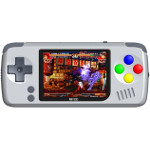

# PocketGo

  
|Component|Description                               |
|---------|------------------------------------------|
|CPU      |Allwinner F1C500S                         |
|RAM      |32MB                                      |
|Screen   |2.4" IPS 320x240(ST7789V)                 |
|Slot     |MicroSD                                   |
|Gamepad  |DPad, 4 Buttons, Start, Select, Menu, L, R|
|USB      |Client                                    |
|Battery  |3.7V 1000mA                               |
|Dimension|123mm x 56mm x 14mm                       |
|Weight   |100g                                      |
|Others   |Vibrator                                  |
  
### https://steward-fu.github.io/website/index.htm

